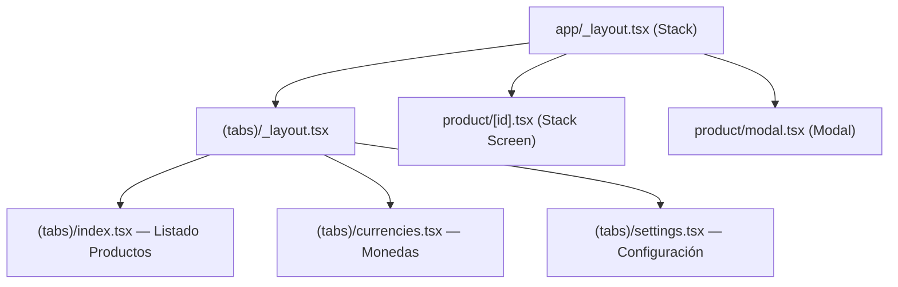

# Design Document: Product Sales Management

## Overview

Aplicación mobile Expo/React Native para gestión de productos con cálculo de precios en múltiples monedas venezolanas (Bolívares). El usuario registra productos con su costo en USD y un porcentaje de utilidad; configura tasas de cambio (ej. Binance, BCV); y la app calcula automáticamente los precios de venta en USD y VES para cada tasa, usando la tasa más alta como moneda de referencia para ajustar el costo real.

La app se construye sobre la estructura Expo/expo-router existente, extendiendo los tabs actuales y añadiendo pantallas de detalle y modales de creación/edición.

---

## Architecture

### Decisiones de diseño

**Estado global: Context API (sin Zustand)**
El proyecto no tiene Zustand instalado. Context API es suficiente para este dominio (dos colecciones: productos y monedas) y evita añadir dependencias. Se crean dos contextos independientes: `ProductsContext` y `CurrenciesContext`, cada uno con su propio reducer.

**Persistencia: AsyncStorage**
Requiere instalación (`npx expo install @react-native-async-storage/async-storage`). Es la solución estándar de Expo para persistencia local. Cada contexto persiste su colección en una clave separada.

**Imagen del producto: expo-image-picker**
Requiere instalación (`npx expo install expo-image-picker`). Si el usuario prefiere no instalarlo, el campo `imageUri` acepta una URI de texto manual. El diseño soporta ambos casos.

**Cálculo de precios: función pura**
Toda la lógica de cálculo vive en `utils/price-calculator.ts` como función pura sin efectos secundarios, fácilmente testeable.

### Diagrama de navegación



### Flujo de datos

```mermaid
flowchart LR
  AsyncStorage -->|load on mount| Context
  Context -->|state| Screens
  Screens -->|dispatch actions| Context
  Context -->|persist on change| AsyncStorage
  Context -->|products + currencies| PriceCalculator
  PriceCalculator -->|PriceResult[]| ProductDetail
```

---

## Components and Interfaces

### Estructura de archivos

```
app/
  _layout.tsx                    # Stack root (existente, modificar)
  (tabs)/
    _layout.tsx                  # Tab layout (modificar: 3 tabs)
    index.tsx                    # Tab 1: Listado de productos
    currencies.tsx               # Tab 2: Gestión de monedas
    settings.tsx                 # Tab 3: Configuración
  product/
    [id].tsx                     # Detalle de producto
    modal.tsx                    # Modal crear/editar producto

context/
  products-context.tsx           # Context + reducer + AsyncStorage
  currencies-context.tsx         # Context + reducer + AsyncStorage

utils/
  price-calculator.ts            # Función pura calculatePrices
  storage.ts                     # Helpers AsyncStorage tipados

components/
  product-card.tsx               # Tarjeta en el listado
  product-form.tsx               # Formulario crear/editar producto
  currency-card.tsx              # Fila de moneda en el listado
  currency-form.tsx              # Formulario crear/editar moneda
  price-breakdown.tsx            # Sección de precios por moneda en detalle
  empty-state.tsx                # Componente genérico de estado vacío
```

### Componentes principales

**`product-card.tsx`**
- Props: `product: Product`, `onPress: () => void`, `onEdit: () => void`, `onDelete: () => void`
- Muestra: imagen (expo-image), nombre, costo USD

**`product-form.tsx`**
- Props: `initialValues?: Partial<Product>`, `onSubmit: (data: ProductFormData) => void`, `onCancel: () => void`
- Campos: nombre (TextInput), costoUSD (TextInput numérico), utilidad (TextInput numérico), imageUri (TextInput o picker)
- Validación inline con mensajes de error por campo

**`currency-card.tsx`**
- Props: `currency: Currency`, `isReference: boolean`, `onEdit: () => void`, `onDelete: () => void`
- Muestra badge "Referencia" cuando `isReference === true`

**`currency-form.tsx`**
- Props: `initialValues?: Partial<Currency>`, `onSubmit: (data: CurrencyFormData) => void`, `onCancel: () => void`
- Campos: nombre, tasa (TextInput numérico)

**`price-breakdown.tsx`**
- Props: `results: PriceResult[]`
- Renderiza una sección por cada `PriceResult` con: nombre moneda, costoAjustadoUSD, precioVentaUSD, precioVentaVES, badge de referencia

**`empty-state.tsx`**
- Props: `message: string`, `actionLabel?: string`, `onAction?: () => void`

---

## Data Models

```typescript
// types/index.ts

export interface Product {
  id: string;           // UUID generado al crear
  name: string;         // Nombre del producto (no vacío)
  costUSD: number;      // Costo de compra en USD (> 0)
  profitPercent: number;// Porcentaje de utilidad (0–1000)
  imageUri?: string;    // URI de imagen local o remota (opcional)
  createdAt: string;    // ISO 8601
}

export interface Currency {
  id: string;           // UUID generado al crear
  name: string;         // Ej. "Binance", "BCV" (no vacío)
  rate: number;         // Bolívares por 1 USD (> 0)
}

// Resultado de cálculo para una moneda dada
export interface PriceResult {
  currency: Currency;
  isReference: boolean;       // true si esta moneda es la de mayor tasa
  adjustedCostUSD: number;    // costUSD × (refRate / currency.rate)
  salePriceUSD: number;       // adjustedCostUSD × (1 + profitPercent/100)
  salePriceVES: number;       // salePriceUSD × currency.rate
}

// Datos del formulario de producto (antes de crear el objeto completo)
export interface ProductFormData {
  name: string;
  costUSD: string;       // string para el TextInput, se parsea al guardar
  profitPercent: string;
  imageUri?: string;
}

// Datos del formulario de moneda
export interface CurrencyFormData {
  name: string;
  rate: string;
}

// Errores de validación
export interface ProductValidationErrors {
  name?: string;
  costUSD?: string;
  profitPercent?: string;
}

export interface CurrencyValidationErrors {
  name?: string;
  rate?: string;
}
```

### Claves AsyncStorage

```typescript
// utils/storage.ts
export const STORAGE_KEYS = {
  PRODUCTS: '@psm/products',
  CURRENCIES: '@psm/currencies',
} as const;
```

---

## Price Calculator

```typescript
// utils/price-calculator.ts

/**
 * Calcula los precios de venta de un producto para cada moneda configurada.
 * Función pura: sin efectos secundarios, sin estado externo.
 *
 * Lógica:
 *  1. Identifica la moneda de referencia (mayor tasa).
 *  2. Para cada moneda:
 *     - adjustedCostUSD = costUSD × (refRate / currency.rate)
 *     - salePriceUSD    = adjustedCostUSD × (1 + profitPercent / 100)
 *     - salePriceVES    = salePriceUSD × currency.rate
 */
export function calculatePrices(
  costUSD: number,
  profitPercent: number,
  currencies: Currency[]
): PriceResult[] {
  if (currencies.length === 0) return [];

  const refRate = Math.max(...currencies.map(c => c.rate));

  return currencies.map(currency => {
    const isReference = currency.rate === refRate;
    const adjustedCostUSD = costUSD * (refRate / currency.rate);
    const salePriceUSD = adjustedCostUSD * (1 + profitPercent / 100);
    const salePriceVES = salePriceUSD * currency.rate;

    return {
      currency,
      isReference,
      adjustedCostUSD: round2(adjustedCostUSD),
      salePriceUSD: round2(salePriceUSD),
      salePriceVES: round2(salePriceVES),
    };
  });
}

function round2(n: number): number {
  return Math.round(n * 100) / 100;
}
```

---

## State Management

### ProductsContext

```typescript
// context/products-context.tsx
type ProductsAction =
  | { type: 'LOAD'; payload: Product[] }
  | { type: 'ADD'; payload: Product }
  | { type: 'UPDATE'; payload: Product }
  | { type: 'DELETE'; payload: string }; // id

interface ProductsState {
  products: Product[];
  loading: boolean;
  error: string | null;
}
```

- Al montar: lee `@psm/products` de AsyncStorage → dispatch `LOAD`
- En cada cambio de `products`: persiste en AsyncStorage
- Expone: `products`, `loading`, `error`, `addProduct`, `updateProduct`, `deleteProduct`

### CurrenciesContext

```typescript
// context/currencies-context.tsx
type CurrenciesAction =
  | { type: 'LOAD'; payload: Currency[] }
  | { type: 'ADD'; payload: Currency }
  | { type: 'UPDATE'; payload: Currency }
  | { type: 'DELETE'; payload: string };

interface CurrenciesState {
  currencies: Currency[];
  loading: boolean;
  error: string | null;
}
```

- Misma lógica de carga/persistencia con clave `@psm/currencies`
- Expone: `currencies`, `loading`, `error`, `addCurrency`, `updateCurrency`, `deleteCurrency`
- Expone también: `referenceCurrency: Currency | null` (la de mayor tasa)

### Providers en `app/_layout.tsx`

```tsx
<CurrenciesProvider>
  <ProductsProvider>
    <ThemeProvider ...>
      <Stack>...</Stack>
    </ThemeProvider>
  </ProductsProvider>
</CurrenciesProvider>
```

---

## Correctness Properties

*A property is a characteristic or behavior that should hold true across all valid executions of a system — essentially, a formal statement about what the system should do. Properties serve as the bridge between human-readable specifications and machine-verifiable correctness guarantees.*

### Property 1: Moneda de referencia es la de mayor tasa

*For any* lista no vacía de monedas, `calculatePrices` debe marcar como `isReference = true` exactamente a la moneda con el mayor valor de `rate`, y `isReference = false` a todas las demás.

**Validates: Requirements 4.1, 4.2**

---

### Property 2: Costo ajustado de la moneda de referencia es igual al costo original

*For any* producto y lista de monedas, el `adjustedCostUSD` de la moneda de referencia debe ser igual a `costUSD` (ratio refRate/refRate = 1).

**Validates: Requirements 5.2**

---

### Property 3: Round-trip de serialización de productos

*For any* lista de productos válidos, serializar a JSON y deserializar debe producir una lista equivalente (mismos ids, nombres, costos, utilidades).

**Validates: Requirements 8.1, 8.3**

---

### Property 4: Round-trip de serialización de monedas

*For any* lista de monedas válidas, serializar a JSON y deserializar debe producir una lista equivalente.

**Validates: Requirements 8.2, 8.3**

---

### Property 5: Precio de venta VES es consistente con USD × tasa

*For any* producto y lista de monedas, para cada resultado `salePriceVES` debe ser igual a `salePriceUSD × currency.rate` (con precisión de 2 decimales).

**Validates: Requirements 5.4**

---

### Property 6: Validación rechaza nombres vacíos o en blanco

*For any* string compuesto únicamente de espacios en blanco (o vacío), la validación del nombre de producto o moneda debe retornar un error y no permitir la creación.

**Validates: Requirements 2.6, 3.5**

---

### Property 7: Validación rechaza costos y tasas no positivos

*For any* valor numérico ≤ 0, la validación de `costUSD` (producto) o `rate` (moneda) debe retornar un error.

**Validates: Requirements 2.7, 3.6**

---

### Property 8: Utilidad fuera de rango es rechazada

*For any* valor numérico fuera del intervalo [0, 1000], la validación de `profitPercent` debe retornar un error.

**Validates: Requirements 2.8**

---

### Property 9: Caso concreto de cálculo (Binance 40, BCV 30, costo 1 USD, utilidad 10%)

*For the* entrada específica `costUSD=1`, `profitPercent=10`, `currencies=[{name:"Binance",rate:40},{name:"BCV",rate:30}]`, los resultados deben ser exactamente:
- Binance: `adjustedCostUSD=1.00`, `salePriceUSD=1.10`, `salePriceVES=44.00`
- BCV: `adjustedCostUSD=1.33`, `salePriceUSD=1.46`, `salePriceVES=43.80`

**Validates: Requirements 7.1, 7.2**

---

## Error Handling

| Escenario | Comportamiento |
|---|---|
| Error al leer AsyncStorage al iniciar | Estado vacío + mensaje de error visible al usuario (Req 8.4) |
| Error al escribir AsyncStorage | Log de error; no bloquear la UI; reintentar en próximo cambio |
| Lista de monedas vacía en detalle de producto | Mostrar `EmptyState` con mensaje "Configura tasas de cambio" (Req 6.5) |
| Validación fallida en formulario | Mensajes de error inline por campo, sin cerrar el modal (Req 2.9, 3.6) |
| `costUSD` o `rate` no parseables como número | Tratar como inválido, mostrar error de validación |

---

## Testing Strategy

### Librerías recomendadas

- **Unit/integration tests**: Jest + `@testing-library/react-native` (ya disponible con Expo)
- **Property-based tests**: `fast-check` (`npm install --save-dev fast-check`)

### Unit tests (ejemplos concretos y edge cases)

- `calculatePrices` con lista vacía → retorna `[]`
- `calculatePrices` con una sola moneda → `isReference=true`, `adjustedCostUSD=costUSD`
- Caso concreto Req 7.1 (Binance 40, BCV 30)
- Validación: nombre vacío, costo negativo, utilidad = 1001
- Carga de AsyncStorage: simular error → estado vacío + error

### Property-based tests (fast-check, mínimo 100 iteraciones)

Cada test referencia su propiedad del diseño con el tag:
`// Feature: product-sales-management, Property N: <texto>`

```typescript
// Property 1: Moneda de referencia es la de mayor tasa
fc.assert(fc.property(
  fc.array(fc.record({ id: fc.uuid(), name: fc.string(), rate: fc.float({ min: 0.01 }) }), { minLength: 1 }),
  fc.float({ min: 0.01 }), fc.float({ min: 0, max: 1000 }),
  (currencies, costUSD, profitPercent) => {
    const results = calculatePrices(costUSD, profitPercent, currencies);
    const maxRate = Math.max(...currencies.map(c => c.rate));
    const refResults = results.filter(r => r.isReference);
    return refResults.length >= 1 && refResults.every(r => r.currency.rate === maxRate);
  }
), { numRuns: 100 });

// Property 2: Costo ajustado de referencia = costUSD
// Property 3 & 4: Round-trip JSON serialización
// Property 5: salePriceVES = salePriceUSD × rate
// Property 6: Validación nombres en blanco
// Property 7: Validación costos/tasas no positivos
// Property 8: Validación utilidad fuera de rango
```

### Cobertura objetivo

- `utils/price-calculator.ts`: 100% (función pura, fácil de testear)
- Funciones de validación: 100%
- Helpers de storage: 80%+
- Componentes: smoke tests con `@testing-library/react-native`
